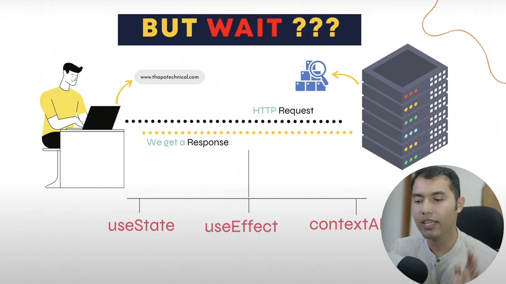
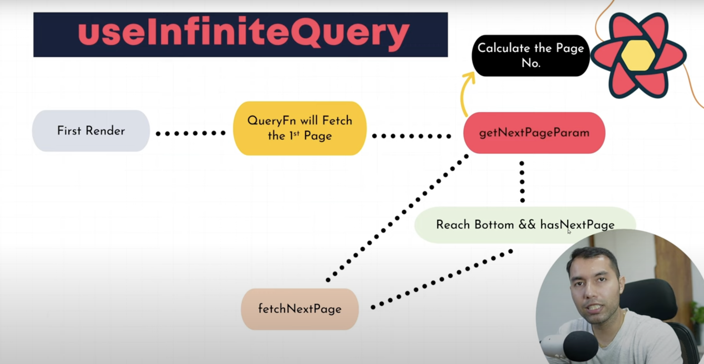

# TanStack-Query

**NOTE :** TanStack-Query === React-Query

- It's a library that helps you manage the state of data, you fetch from servers, like API's, in your React application.

- It manages server-side state in React.

### Need of TanStack-Query : 



- If TanStack-Query is not used, we have to do manage the state of data coming form the server, using `useState`, `useEffect`, `contextAPI`, `Redux-Toolkit`, `Zustand`,  etc. 

### Advantages of using TanStack-Query : 

- **Data Fetching Made Easy :** With a simple useQuery hook, fetching data becomes super easy.

- **Built-in Loading and Error States :** No need to write custom code for handling loading, errors, or success states.

- **Automatic Caching :** React Query automatically caches your data.

- **Background Refetching :** If your data gets stale or out of date, TanStack Query can refetch it in the background.

- **Pagination and Infinite Scrolling :** Handling pagination or infinite scrolling? React Query has you covered with tools specifically designed for those complex use cases.

### QueryClient 

- **QueryClient :** It is the core part of the react-query library. It manages the caching, background fetching, data synchronization, and other query-related logic. It provides a centralized store for managing and caching asynchronous data in your application.

- **new QueryClient() :** This creates a new QueryClient instance with default settings. You can configure it with options if needed (e.g., setting cache time, stale time, etc.).

- ** QueryClientProvider :** This component is part of react-query and is used to provide the QueryClient instance to your entire React app (or a portion of it). This makes the query client available via React's context API so that all the components in the tree can use the useQuery, useMutation, and other hooks provided by react-query.

### queryKey 

- The queryKey is typically an array or string that uniquely identifies a query.

- It allows React Query to determine if the data in the cache is associated with a particular request.

- It is used to cache the data with a specific key and refetch or update data when certain dependencies change.

### Note :

- **useQuery** : Fetches and reads data (GET requests) from an API and automatically caches the result.

- **useMutation** : Used for creating, updating or deleting data (POST, PUT, DELETE requests) and allows triggering manual side effects.

### Garbage collection in React-Query | gcTime - (Garbage Collection Time) : 

- In React Query v5, the `cacheTime` option in React Query has been renamed to `gcTime`.

- When you use React Query to get data, it saves the results in a local cache. This means if you ask for the same data again, React Query will give you the saved data instead of making another API request. The cache updates automatically if the data changes, so you always get the latest information.

- **Use Case :** Imagine you're fetching a list of users. If you go back to the same page, React Query will show the saved list from the cache instead of reloading it from the server, making your app faster. If a new user is added, React Query will automatically update the list.

- By default, inactive queries are garbage collected after 5 minutes. This means that if a query is not being used for 5 minutes, the cache for that query will be cleaned up.

### staleTime

In React Query, staleTime is a configuration option that determines how long fetched data is considered fresh before it needs to be refetched.

Here's how it works:

**Fresh Data :**
When data is initially fetched or updated, it's considered fresh.

**Stale Data :**
After the staleTime duration (specified in milliseconds) elapses, the data is considered stale.

**Default Value :**
The default staleTime is 0, meaning data becomes stale immediately after being fetched. This ensures data is always up-to-date but can lead to frequent refetching.

## Polling

- In React Query, polling refers to the technique of fetching data from an API at regular intervals to keep the UI up-to-date with the latest information. 

- This is especially useful for scenarios where data changes frequently and you want to display real-time updates without requiring the user to manually refresh the page.

### `refetchInterval` option:

- The simplest way to enable polling is to pass the refetchInterval option to the useQuery hook. 

- This option specifies the interval (in milliseconds) at which React Query should automatically refetch the data.

**Problems with polling :** The moment you switch to other tabs or website, the polling will be pasued untill you re-open the website created by you. 

### refetchIntervalInBackground option :

- Used when you want to fetch the data even in background or you are in another tab.

- If you want to continue polling even when the component is not mounted, you can use the `refetchIntervalInBackground` option.

### `queryKey` : 

- The queryKey is an essential part of prefetching queries in TanStack Query. 

- It uniquely identifies the query and is used to cache and manage the state of the query. 

- When prefetching, you can use the queryKey to specify which data you want to prefetch.

**Here's an example of how you can use queryKey in a prefetching scenario:**

```JavaScript
const queryClient = useQueryClient();

const prefetchArticleComments = async (id) => {
  await queryClient.prefetchQuery({
    queryKey: ['article-comments', id],
    queryFn: getArticleCommentsById,
  });
};
```

- In this example, ['article-comments', id] is the queryKey used to identify the query for fetching article comments. 

- The queryFn is the function that fetches the data, and prefetchQuery is used to initiate the prefetching process.

- You can use this approach to prefetch data during component lifecycle events, user interactions, or other scenarios where you anticipate needing the data soon. 

- This helps in reducing the request waterfall and improving the performance of your application.

### useMutation Hook : 

- It is used to modify or send data to a server (Create, Update or Delete operations).

- `useQuery` hook is used to fetch and cache data from a server (read operation).

- The `useMutation` hook is part of React Query and is used for operations that modify data, like Create, Update, and Delete (CRUD operations).

Syntax:

```js
const mutation = useMutation(mutationFn, {
    // Optional configuration options
});
```

- We can provide various configuration options to customize the behavior of the mutation, such as:

  - `onSuccess`: A callback function that runs when the mutation is successful.
  - `onError`: A callback function that runs if the mutation fails.
  - `onSettled`: A callback function that runs regardless of success or failure.
  - `f`: A unique key to identify the mutation in the cache.

### Mutate() : 

- The `mutate()` function is used to execute the mutation in React Query.

- The process is the same whether you're:

  - Deleting data
  - Updating data
  - Creating new data

- When you call` .mutate()`, it tells React Query to run the mutation function defined inside the useMutation hook. 

- This is needed because the mutation is an action that changes data, unlike queries, which are used to fetch data and are often auto-executed.

### Accessing the local cache data : 

- `queryClient.setQueryData` is used to update the cached data for a specific query. In this case, it's the query with the key["post", pageNumber], which lickely represents the list of posts on the current page. 

- setQueryData is the method which helps us to access the cached data.

### Scroll Events

- **window.innerHeight :** The height of the visible part of the webpage (the viewport).

- **window.scrollY :** The amount of pixels the user has scrolled down the page.

- **document.documentElement.scrollHeight :** The total height of the webpage, including the part not visible without scrolling.

- When the sum of `window.innerHeight` and `window.scrollY` is approximately equal to `document.documentElement.scrollHeight - 1`, the user is near the bottom of the page.

- **getNextPageParam :** Calculate the page number.

- **pageParam :** Page number

